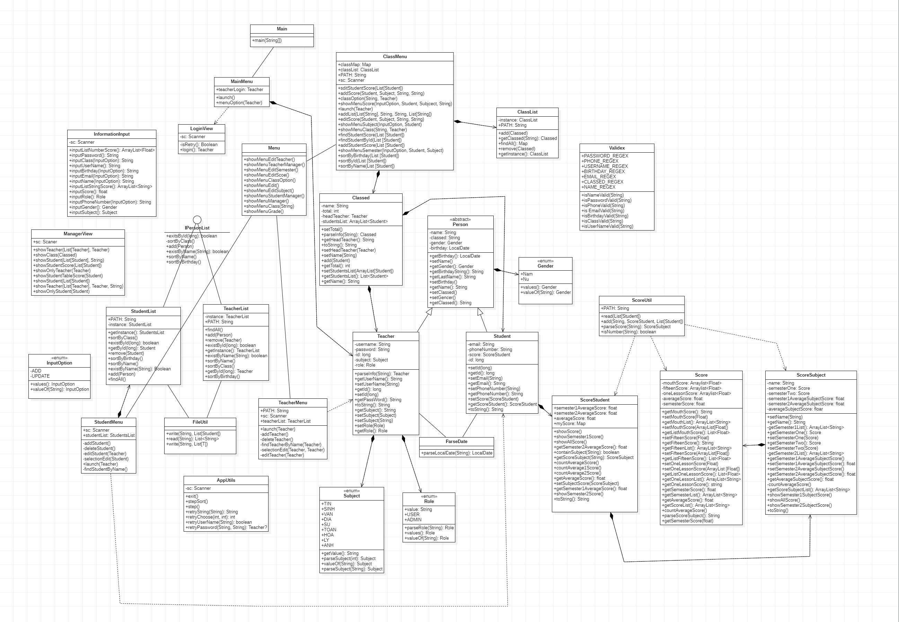
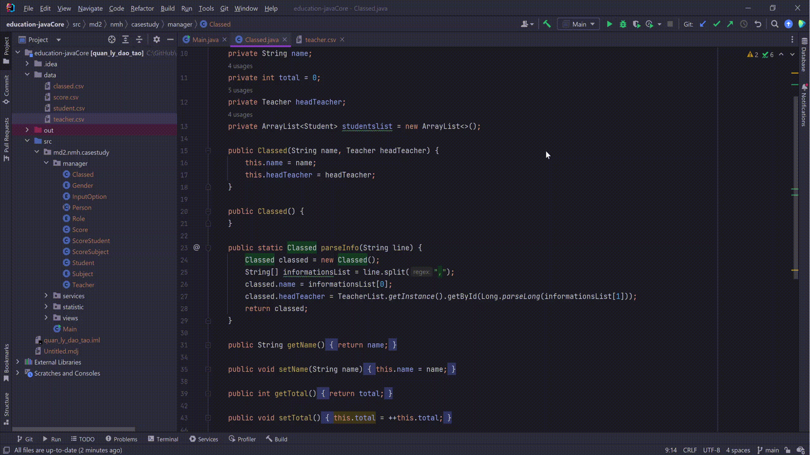
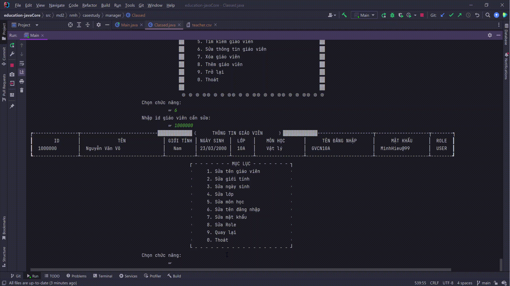

# Java Core

## Introduction

This is an educational management
system, allowing to perform the functions of adding, editing,
deleting students, teachers, and managing grades for
students 💖

## Technology
Project is created with: 
 : Java

## Demo project

   
  <i>UML </i>

   
  <i>Login</i>

   
  <i>Teachers manager</i>

   
  <i>Students manager</i>

   
  <i>Class manager</i>

